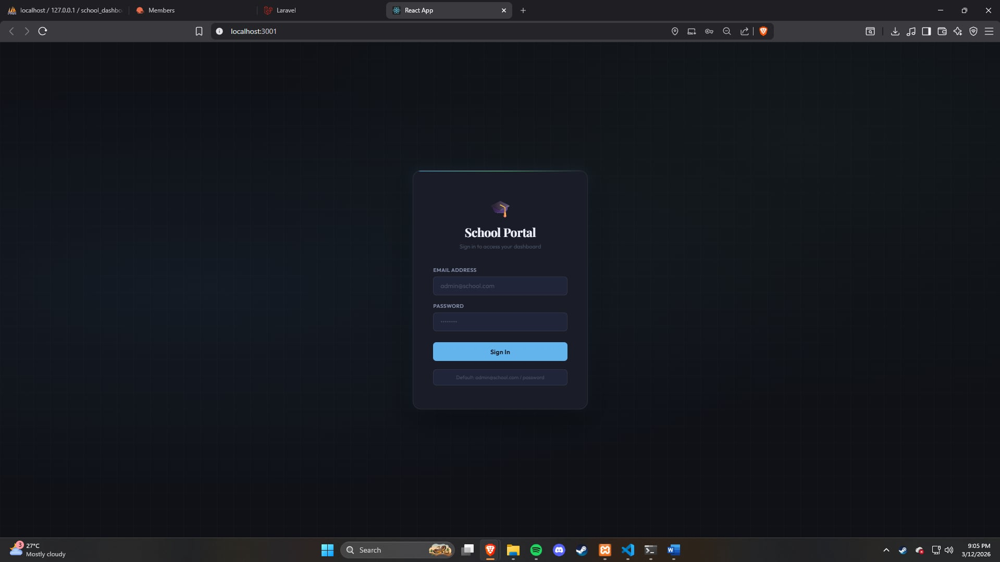
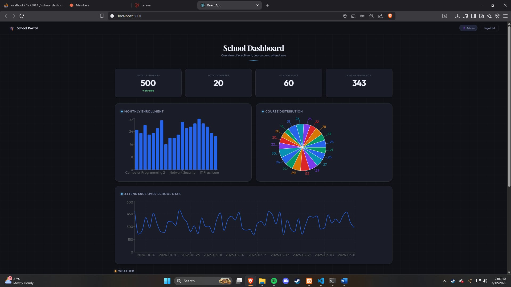
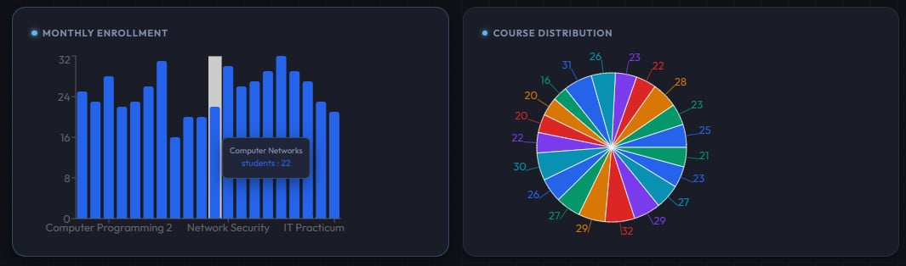
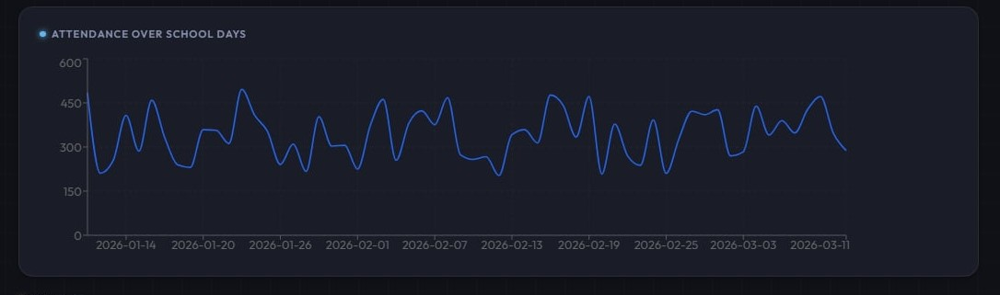
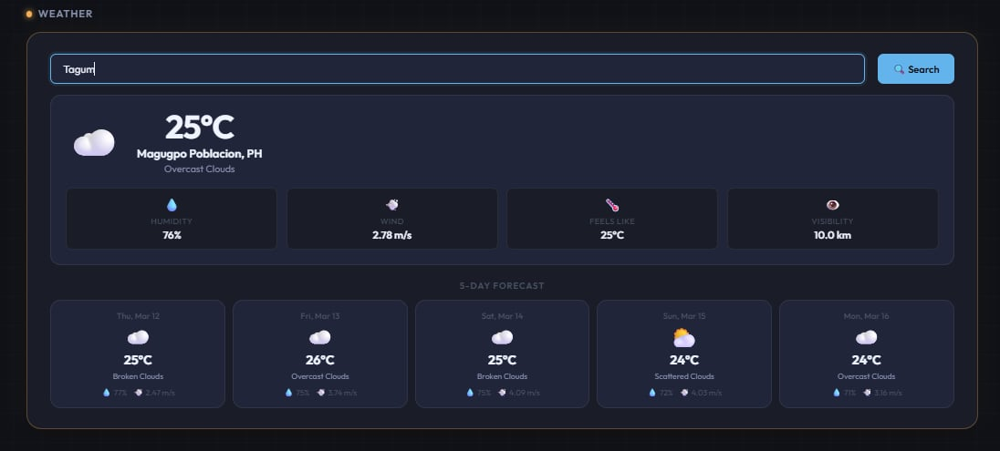

# School Dashboard — IT15/L Integrative Programming Final Project

A full-stack web application built with **React.js** (frontend) and **Laravel** (backend) featuring authentication, data visualization, and real-time weather integration.

---

## Screenshots

### Login Page


### Dashboard Overview


### Bar Chart & Pie Chart


### Attendance Line Chart


### Weather Widget


---

## Technologies Used

### Frontend
| Technology | Version | Purpose |
|-----------|---------|---------|
| React.js | 18.x | Frontend framework |
| Recharts | 2.x | Data visualization charts |
| Axios | 1.x | HTTP requests to Laravel API |
| OpenWeatherMap API | 2.5 | Real-time weather data |

### Backend
| Technology | Version | Purpose |
|-----------|---------|---------|
| Laravel | 11.x | RESTful API backend |
| Laravel Sanctum | 4.x | API token authentication |
| MySQL | 8.x | Database |
| PHP | 8.2+ | Server-side language |

---

## Project Structure

```
guiasfinal/
├── screenshots/
│   ├── login.png
│   ├── dashboard.png
│   ├── charts.png
│   ├── attendance.png
│   └── weather.png
├── README.md
├── laravel-backend/
│   ├── app/
│   │   ├── Http/Controllers/
│   │   │   ├── AuthController.php
│   │   │   ├── StudentController.php
│   │   │   ├── CourseController.php
│   │   │   └── DashboardController.php
│   │   └── Models/
│   │       ├── User.php
│   │       ├── Student.php
│   │       ├── Course.php
│   │       └── SchoolDay.php
│   ├── database/
│   │   ├── migrations/
│   │   └── seeders/
│   │       ├── UserSeeder.php
│   │       ├── StudentSeeder.php
│   │       ├── CourseSeeder.php
│   │       └── SchoolDaySeeder.php
│   └── routes/
│       └── api.php
│
└── react-frontend/
    └── src/
        ├── components/
        │   ├── auth/
        │   │   └── Login.jsx
        │   ├── dashboard/
        │   │   ├── Dashboard.jsx
        │   │   ├── EnrollmentChart.jsx
        │   │   ├── CourseDistributionChart.jsx
        │   │   └── AttendanceChart.jsx
        │   ├── weather/
        │   │   ├── WeatherWidget.jsx
        │   │   └── ForecastDisplay.jsx
        │   └── common/
        │       ├── Navbar.jsx
        │       ├── LoadingSpinner.jsx
        │       ├── DashboardSkeleton.jsx
        │       └── ErrorBoundary.jsx
        └── services/
            ├── api.js
            └── weatherApi.js
```

---

## Setup Instructions

### Prerequisites
- PHP 8.2+
- Composer
- Node.js 18+
- npm
- MySQL

---

### Backend Setup (Laravel)

```bash
cd laravel-backend
composer install
cp .env.example .env
php artisan key:generate
php artisan sanctum:install
php artisan migrate --seed
php artisan serve
```

The Laravel API will be running at: `http://127.0.0.1:8000`

---

### Frontend Setup (React)

```bash
cd react-frontend
npm install
npm start
```

Create a `.env` file in `react-frontend/` and add:
```
REACT_APP_WEATHER_API_KEY=2ffcec49783c6b0a3d4b9c965baa9a2c
```

The React app will be running at: `http://localhost:3000`

---

## Default Login Credentials

```
Email:    admin@school.com
Password: password
```

---

## API Endpoints

| Method | Endpoint | Auth Required | Description |
|--------|----------|---------------|-------------|
| POST | `/api/login` | No | Login and get token |
| GET | `/api/me` | Yes | Get current user |
| POST | `/api/logout` | Yes | Logout and revoke token |
| GET | `/api/students` | Yes | Get all students |
| GET | `/api/courses` | Yes | Get all courses |
| GET | `/api/dashboard` | Yes | Get school days & attendance |

---

## Features

- **Authentication** — Secure login with form validation, Laravel Sanctum token-based auth, protected routes, and logout
- **Student Data** — 500 seeded student records with name, gender, age, and enrolled course
- **Course Data** — 20 real BSIT courses across departments
- **Charts** — Interactive bar, pie, and line charts powered by Recharts
- **Weather Widget** — Real-time weather with auto geolocation, city search, current conditions, and 5-day forecast
- **Responsive Design** — Works on desktop and mobile
- **Error Handling** — Error boundaries, API error states, and skeleton loading indicators

---

## Author

- **Name:** Guias, Kyle Adrienne O.
- **Course:** IT15/L — Integrative Programming
- **School:** University of Mindanao Visayan Campus
